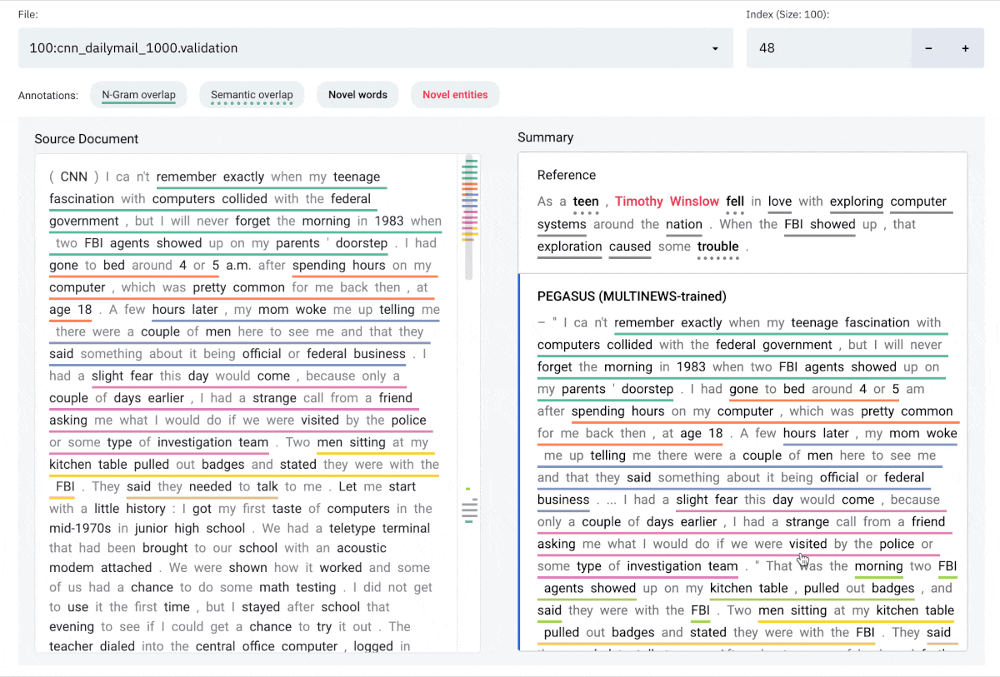
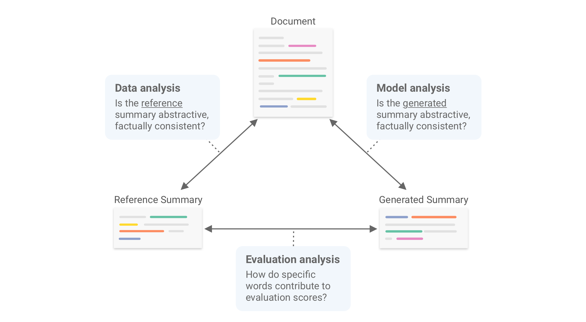
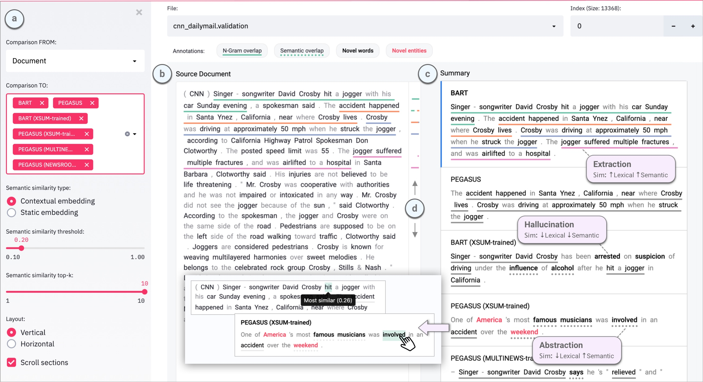

SummVis is an interactive visualization tool for text summarization systems, supporting analysis of models,
data, and evaluation metrics. 

Authors: [Jesse Vig](https://twitter.com/jesse_vig)<sup>1</sup>, 
[Wojciech Kryściński](https://twitter.com/iam_wkr)<sup>1</sup>,
 [Karan Goel](https://twitter.com/krandiash)<sup>2</sup>,
  [Nazneen Fatema Rajani](https://twitter.com/nazneenrajani)<sup>1</sup><br/>
  <sup>1</sup>[Salesforce Research](https://einstein.ai/) <sup>2</sup>[Stanford Hazy Research](https://hazyresearch.stanford.edu/)

📖 [Paper](https://arxiv.org/abs/2104.07605)
🎥 [Demo](https://vimeo.com/540429745)

<p>
    
</p>

_Note: SummVis is under active development, so expect continued updates in the coming weeks and months.
 Feel free to raise issues for questions, suggestions, requests or bug reports._

## Table of Contents
- [User guide](#user-guide)
- [Installation](#installation)
- [Quickstart](#quickstart)
- [General instructions for running with pre-loaded datasets](#general-instructions-for-running-with-pre-loaded-datasets)
- [Get your data into SummVis](#get-your-data-into-summvis)
- [Generating predictions](#generating-predictions)
- [Citation](#citation)
- [Acknowledgements](#acknowledgements)

## User guide

### Overview
SummVis is a tool for analyzing abstractive summarization systems. It provides fine-grained insights on summarization
models, data, and evaluation metrics by visualizing the relationships between source documents, reference summaries,
and generated summaries, as illustrated in the figure below.<br/>

 

### Interface

The SummVis interface is shown below. The example displayed is the first record from the
 [CNN / Daily Mail](https://huggingface.co/datasets/cnn_dailymail) validation set. 

 


#### Components

**(a)** Configuration panel<br/>
**(b)** Source document (or reference summary, depending on configuration)<br/>
**(c)** Generated summaries (and/or reference summary, depending on configuration)<br/>
**(d)** Scroll bar with global view of annotations<br/>

#### Annotations   


**N-gram overlap:** Word sequences that overlap between the document on the left and
 the selected summary on the right. Underlines are color-coded by index of summary sentence. <br/>
**Semantic overlap**: Words in the summary that are semantically close to one or more words in document on the left.<br/>
**Novel words**: Words in the summary that do not appear in the document on the left.<br/>
**Novel entities**: Entity words in the summary that do not appear in the document on the left.<br/>

### Limitations   
Currently only English text is supported.

## Installation
**IMPORTANT**: Please use `python>=3.8` since some dependencies require that for installation.
```zsh
git clone https://github.com/robustness-gym/summvis.git
cd summvis
pip install -r requirements.txt
python -m spacy download en_core_web_sm
```

Installation takes around 2 minutes on a Macbook Pro.

## Quickstart
Follow the steps below to start using SummVis immediately.

### 1. Download and extract data
Download our pre-cached dataset that contains predictions for state-of-the-art models such as PEGASUS and BART on 
1000 examples taken from the CNN / Daily Mail validation set.
```shell
mkdir data
mkdir preprocessing
curl https://storage.googleapis.com/sfr-summvis-data-research/cnn_dailymail_1000.validation.anonymized.zip --output preprocessing/cnn_dailymail_1000.validation.anonymized.zip
unzip preprocessing/cnn_dailymail_1000.validation.anonymized.zip -d preprocessing/
``` 

### 2. Deanonymize data
Next, we'll need to add the original examples from the CNN / Daily Mail dataset to deanonymize the data (this information 
is omitted for copyright reasons). The `preprocessing.py` script can be used for this with the `--deanonymize` flag.

#### Deanonymize 10 examples (`try_it` mode):
```shell
python preprocessing.py \
--deanonymize \
--dataset_rg preprocessing/cnn_dailymail_1000.validation.anonymized \
--dataset cnn_dailymail \
--version 3.0.0 \
--split validation \
--processed_dataset_path data/try:cnn_dailymail_1000.validation \
--try_it
```
This will take either a few seconds or a few minutes depending on whether you've previously loaded CNN/DailyMail from 
the Datasets library.

### 3. Run SummVis
Finally, we're ready to run the Streamlit app. Once the app loads, make sure it's pointing to the right `File` at the top
of the interface.
```shell
streamlit run summvis.py
```

## General instructions for running with pre-loaded datasets

### 1. Download one of the pre-loaded datasets:

##### CNN / Daily Mail (1000 examples from validation set): https://storage.googleapis.com/sfr-summvis-data-research/cnn_dailymail_1000.validation.anonymized.zip
##### CNN / Daily Mail (full validation set): https://storage.googleapis.com/sfr-summvis-data-research/cnn_dailymail.validation.anonymized.zip
##### XSum (1000 examples from validation set): https://storage.googleapis.com/sfr-summvis-data-research/xsum_1000.validation.anonymized.zip
##### XSum (full validation set): https://storage.googleapis.com/sfr-summvis-data-research/xsum.validation.anonymized.zip

We recommend that you choose the smallest dataset that fits your need in order to minimize download / preprocessing time.

#### Example: Download and unzip CNN / Daily Mail
```shell
mkdir data
mkdir preprocessing
curl https://storage.googleapis.com/sfr-summvis-data-research/cnn_dailymail_1000.validation.anonymized.zip --output preprocessing/cnn_dailymail_1000.validation.anonymized.zip
unzip preprocessing/cnn_dailymail_1000.validation.anonymized.zip -d preprocessing/
``` 

#### Example: Download and unzip XSum
```shell
mkdir data
mkdir preprocessing
curl https://storage.googleapis.com/sfr-summvis-data-research/xsum_1000.validation.anonymized.zip --output preprocessing/xsum_1000.validation.anonymized.zip
unzip preprocessing/xsum_1000.validation.anonymized.zip -d preprocessing/
``` 

### 2. Deanonymize *n* examples:

Set the `--n_samples` argument and name the `--processed_dataset_path` output file accordingly.

#### Example: Deanonymize 100 examples from CNN / Daily Mail:
```shell
python preprocessing.py \
--deanonymize \
--dataset_rg preprocessing/cnn_dailymail_1000.validation.anonymized \
--dataset cnn_dailymail \
--version 3.0.0 \
--split validation \
--processed_dataset_path data/100:cnn_dailymail_1000.validation \
--n_samples 100
```

#### Example: Deanonymize all pre-loaded examples from CNN / Daily Mail (1000 examples dataset):
```shell
python preprocessing.py \
--deanonymize \
--dataset_rg preprocessing/cnn_dailymail_1000.validation.anonymized \
--dataset cnn_dailymail \
--version 3.0.0 \
--split validation \
--processed_dataset_path data/full:cnn_dailymail_1000.validation \
--n_samples 1000
```

#### Example: Deanonymize all pre-loaded examples from CNN / Daily Mail (full dataset):
```shell
python preprocessing.py \
--deanonymize \
--dataset_rg preprocessing/cnn_dailymail.validation.anonymized \
--dataset cnn_dailymail \
--version 3.0.0 \
--split validation \
--processed_dataset_path data/full:cnn_dailymail.validation
```

#### Example: Deanonymize all pre-loaded examples from XSum (1000 examples dataset):
```shell
python preprocessing.py \
--deanonymize \
--dataset_rg preprocessing/xsum_1000.validation.anonymized \
--dataset xsum \
--split validation \
--processed_dataset_path data/full:xsum_1000.validation \
--n_samples 1000
```

### 3. Run SummVis
Once the app loads, make sure it's pointing to the right `File` at the top
of the interface.
```shell
streamlit run summvis.py
```

Alternately, if you need to point SummVis to a folder where your data is stored.
```shell
streamlit run summvis.py -- --path your/path/to/data
```
Note that the additional `--` is not a mistake, and is required to pass command-line arguments in streamlit.


## Get your data into SummVis

The simplest way to use SummVis with your own data is to create a jsonl file of the following format:

```
{"document":  "This is the first source document", "summary:reference": "This is the reference summary", "summary:testmodel1": "This is the summary for testmodel1", "summary:testmodel2": "This is the summary for testmodel2"}
{"document":  "This is the second source document", "summary:reference": "This is the reference summary", "summary:testmodel1": "This is the summary for testmodel1", "summary:testmodel2": "This is the summary for testmodel2"}
```

The key for the reference summary must equal `summary:reference` and the key for any other summary must be of the form
`summary:<summary_name>`, e.g. `summary:BART`. The document is required, as is at least one summary (reference, other, or both).

The following additional install step is required.:
```
python -m spacy download en_core_web_lg
```
 
You have two options to load this jsonl file into the tool:

### Option 1: Load the jsonl file directly

The disadvantage of this approach is that all computations are performed in realtime. This is particularly expensive for 
semantic similarity, which uses a Transformer model. At a result, each example will be slow to load (~5-15 seconds on a Macbook Pro).

1. Place the jsonl file in the `data` directory. Note that the file must be named with a `.jsonl` extension.
2. Start SummVis: `streamlit run summvis.py` 
3. Select your jsonl file from the `File` dropdown at the top of the interface.

### Option 2: Preprocess jsonl file (recommended)

You may run `preprocessing.py` to precompute all data required in the interface (running `spaCy`, lexical and semantic
 aligners) and save a cache file, which can be read directly into the tool.  

1. Run preprocessing script to generate cache file
    ```shell
    python preprocessing.py \
    --workflow \
    --dataset_jsonl path/to/my_dataset.jsonl \
    --processed_dataset_path path/to/my_cache_file
    ```
2. Copy output cache file to the `data` directory
3. Start SummVis: `streamlit run summvis.py`  
4. Select your file from the `File` dropdown at the top of the interface.

As an alternative to steps 2-3, you may point SummVis to a folder in which the cache file is stored:
```shell
streamlit run summvis.py -- --path <parent_directory_of_cache_file>
```

Note that the preprocessing script may run for a while (~5-15 seconds per example on a MacBook Pro for
 documents of typical length found in CNN/DailyMail or XSum), and will be greatly expedited by running on a GPU.
  You may wish to first try it with a subset of your data.

## Generating predictions
The instructions in the previous section assume access to model predictions. We also provide tools to load predictions,
 either by downloading datasets with precomputed predictions or running
a script to generate predictions for HuggingFace-compatible models. In this section we describe an end-to-end pipeline 
for using these tools. 


Prior to running the following, an additional install step is required:

```
python -m spacy download en_core_web_lg
```

### 1. Standardize and save dataset to disk.
Loads in a dataset from HF, or any dataset that you have and stores it in a 
standardized format with columns for `document` and `summary:reference`.  

#### Example: Save CNN / Daily Mail validation split to disk as a jsonl file.
```shell
python preprocessing.py \
--standardize \
--dataset cnn_dailymail \
--version 3.0.0 \
--split validation \
--save_jsonl_path preprocessing/cnn_dailymail.validation.jsonl
```

#### Example: Load custom `my_dataset.jsonl`, standardize, and save.
```shell
python preprocessing.py \
--standardize \
--dataset_jsonl path/to/my_dataset.jsonl \
--save_jsonl_path preprocessing/my_dataset.jsonl
```

Expected format of `my_dataset.jsonl`:
 ```
{"document":  "This is the first source document", "summary:reference": "This is the reference summary"}
{"document":  "This is the second source document", "summary:reference": "This is the reference summary"}
```

If you wish to use column names other than `document` and `summary:reference`, you may specify custom column names
using the `doc_column` and `reference_column` command-line arguments.


### 2. Add predictions to the saved dataset.
Takes a saved dataset that has already been standardized and adds predictions to it 
from prediction jsonl files. Cached predictions for several models available here:
 https://storage.googleapis.com/sfr-summvis-data-research/predictions.zip
 
You may also generate your own predictions using this [this script](generation.py). 

#### Example: Add 6 prediction files for PEGASUS and BART to the dataset.
```shell
python preprocessing.py \
--join_predictions \
--dataset_jsonl preprocessing/cnn_dailymail.validation.jsonl \
--prediction_jsonls \
predictions/bart-cnndm.cnndm.validation.results.anonymized \
predictions/bart-xsum.cnndm.validation.results.anonymized \
predictions/pegasus-cnndm.cnndm.validation.results.anonymized \
predictions/pegasus-multinews.cnndm.validation.results.anonymized \
predictions/pegasus-newsroom.cnndm.validation.results.anonymized \
predictions/pegasus-xsum.cnndm.validation.results.anonymized \
--save_jsonl_path preprocessing/cnn_dailymail.validation.jsonl
```

### 3. Run the preprocessing workflow and save the dataset.
Takes a saved dataset that has been standardized, and predictions already added. 
Applies all the preprocessing steps to it (running `spaCy`, lexical and semantic aligners), 
and stores the processed dataset back to disk.

#### Example: Autorun with default settings on a few examples to try it.
```shell
python preprocessing.py \
--workflow \
--dataset_jsonl preprocessing/cnn_dailymail.validation.jsonl \
--processed_dataset_path data/cnn_dailymail.validation \
--try_it
```

#### Example: Autorun with default settings on all examples.
```shell
python preprocessing.py \
--workflow \
--dataset_jsonl preprocessing/cnn_dailymail.validation.jsonl \
--processed_dataset_path data/cnn_dailymail
```


## Citation

When referencing this repository, please cite [this paper](https://arxiv.org/abs/2104.07605):

```
@misc{vig2021summvis,
      title={SummVis: Interactive Visual Analysis of Models, Data, and Evaluation for Text Summarization}, 
      author={Jesse Vig and Wojciech Kryscinski and Karan Goel and Nazneen Fatema Rajani},
      year={2021},
      eprint={2104.07605},
      archivePrefix={arXiv},
      primaryClass={cs.CL},
      url={https://arxiv.org/abs/2104.07605}
}
```

## Acknowledgements

We thank [Michael Correll](http://correll.io) for his valuable feedback.


